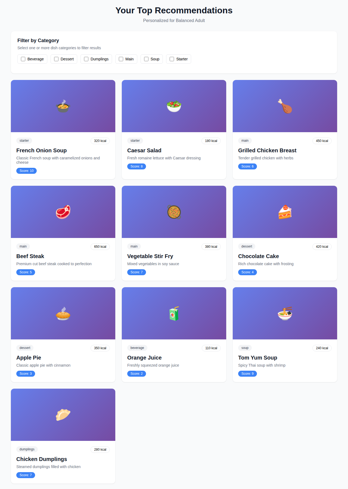
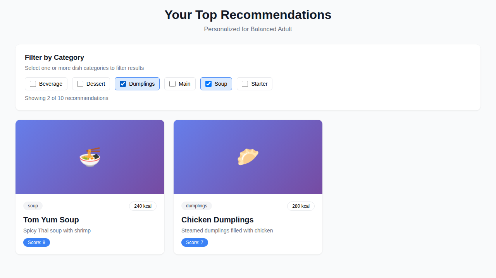
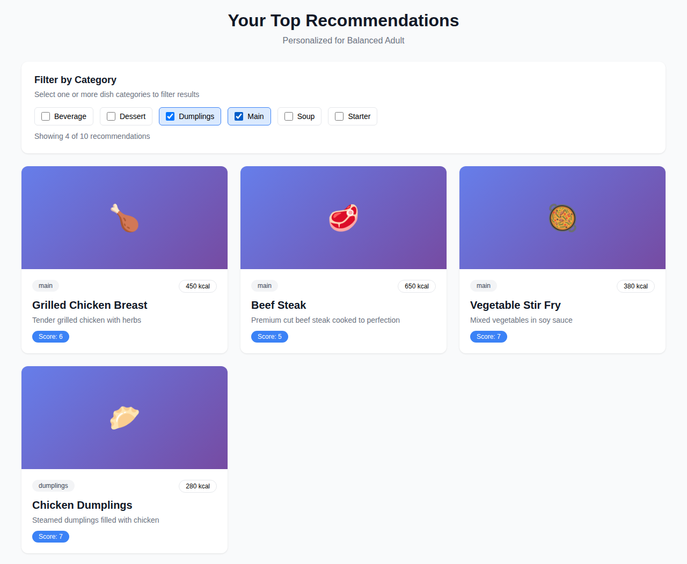

# Category Filtering Feature

## Overview
Users can now filter menu dish recommendations by category (e.g., soup, dumplings, starter, main, dessert, beverage) alongside the existing ingredient-based filtering.

## Implementation

### Changes Made
- Modified `src/pages/Results.tsx` to add category filtering functionality
- Added UI components: Checkbox and Label for category selection
- Implemented client-side filtering logic using React hooks

### Features
1. **Category Extraction**: Automatically extracts unique dish categories from all menu items
2. **Multi-select Filter**: Users can select one or multiple categories simultaneously
3. **Real-time Filtering**: Recommendations update instantly when categories are selected/deselected
4. **Filter Count**: Shows "X of Y recommendations" when filters are active
5. **Empty State**: Displays helpful message when no dishes match selected categories

### Technical Details
- Uses `useMemo` for performance-optimized category extraction and filtering
- Filter state managed with React `useState`
- Works seamlessly with existing ingredient-based recommendation scoring
- Categories are sorted alphabetically for consistent display

## Screenshots

### All Dishes Displayed (No Filter)

### Filtering by Soup and Dumplings

### Filtering by Main and Dumplings

## User Flow
1. User uploads menu and receives recommendations
2. Category filter UI appears showing all available categories
3. User clicks checkboxes to select desired categories
4. Recommendations grid updates to show only selected categories
5. Filter count displays how many dishes match the selection
6. User can clear filters to see all recommendations again

## Categories Supported
The system supports any category returned by the menu parser, including:
- starter
- main
- dessert
- beverage
- soup
- dumplings
- side
- other

New categories are automatically detected and displayed in the filter UI.

## Code Changes
- Added 3 new imports: `Checkbox`, `Label`, `useMemo`
- Added 2 state variables: `allMenuDishes`, `selectedCategories`
- Added 3 computed values: `availableCategories`, `filteredRecommendations`, `toggleCategory`
- Added category filter UI card with checkboxes
- Added empty state for no matching dishes
- Modified recommendations display to use `filteredRecommendations` instead of `recommendations`

Total additions: ~60 lines of code
